# confetti

**A mobile app concept to make connecting with long-distance loved ones more fun and engaging.**

This repo is the interactive Confetti app, built screen-for-screen from the **Confetti Booth** designs in Paper (hibiscus, cobalt, citrus and cream, with the signature sticker/offset-shadow treatment).
Full case study: [yinyeeho.com/pages/confetti](https://yinyeeho.com/pages/confetti)

<h2>Try it out yourself</h2>
https://confetti-app-zeta.vercel.app/
<br/>
<br/>
<br/>

<p align="center">
  <a href="docs/media/hero.mp4">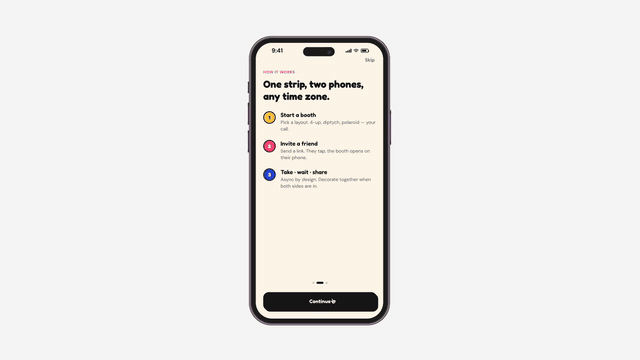</a>
</p>

| Timeline | Role | Services | Tools |
| --- | --- | --- | --- |
| 2 weeks | Product designer | Prototyping · AI-native product design · Copywriting · Branding | Claude · Paper MCP · Flora AI |

---

## The problem with real-time only

Photo booths are synchronous by design: everyone piles in and presses the button at the same second. Pocket Booth copied that constraint onto mobile, so if your best friend lived in Seoul, you simply couldn't booth together.

The fix wasn't a bolted-on "remote mode." It was rethinking the model: let the strip live in an open, *developing* state, half-shot and waiting for the other person, instead of completing in one sitting.

> **"The strip doesn't finish when you shoot. It finishes when you both do."**

That shift created the design problem: how do you show a strip that's only half-real, communicate waiting, and make the moment feel completed *together* despite the distance?

---

## Breakdown of the features

| Create a new shared strip | Photo time + nudge the next person | Decorate the strip | Share the strip or print it out |
| :---: | :---: | :---: | :---: |
| <a href="docs/media/01-create-strip.mp4">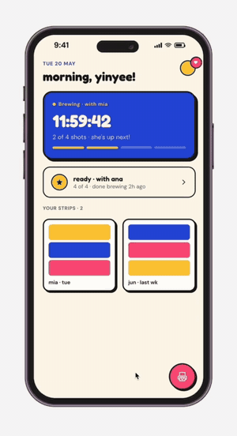</a> | <a href="docs/media/02-photo-nudge.mp4">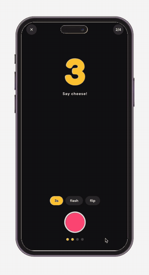</a> | <a href="docs/media/03-decorate.mp4">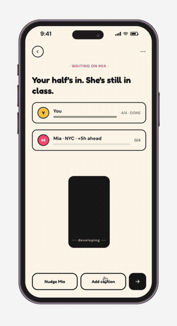</a> | <a href="docs/media/04-share-print.mp4">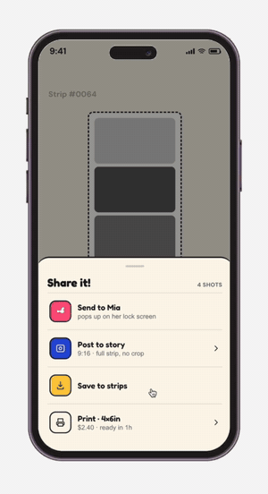</a> |

<sub>Click any preview for the full-quality video.</sub>

---

## Marketing concepts

Explorations of how the app could look once it's live on the website, plus campaigns and promotional material across social.

<p align="center">
  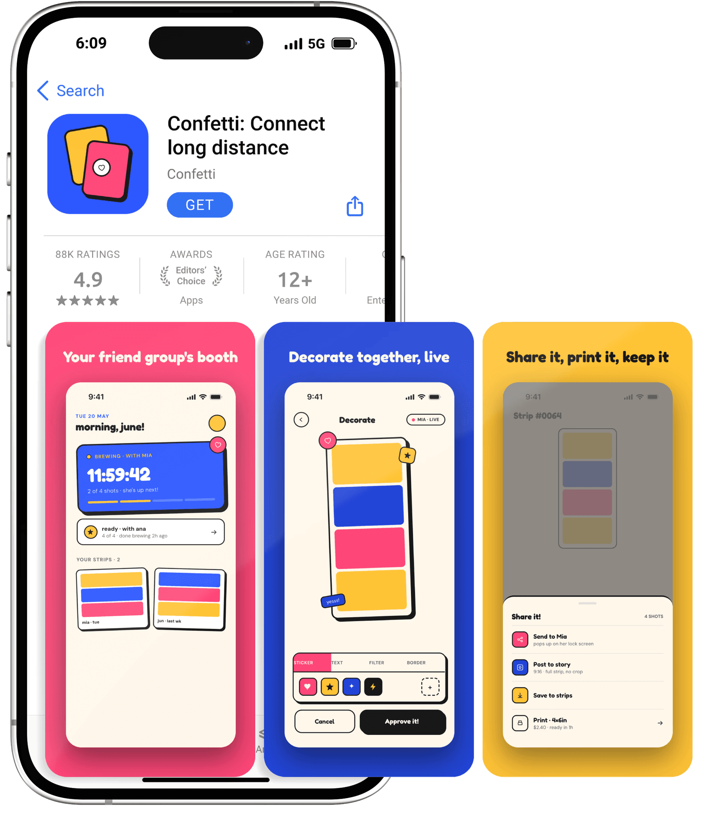
</p>

| Email: invite | Email: strip is ready | Email: welcome |
| :---: | :---: | :---: |
| 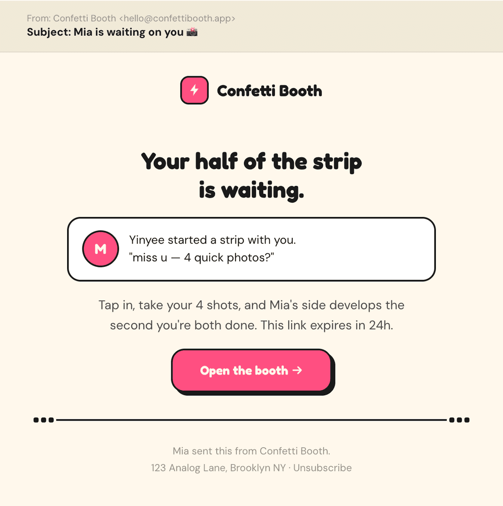 | 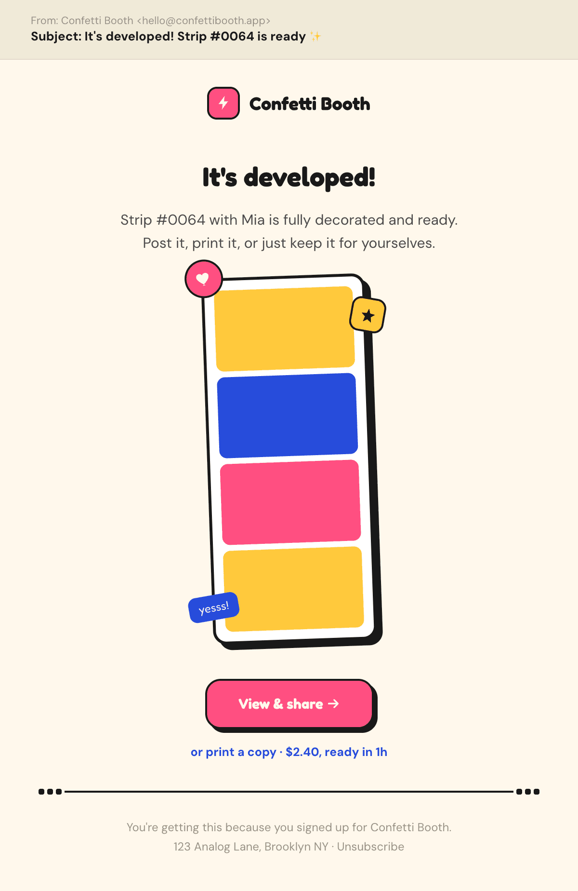 | 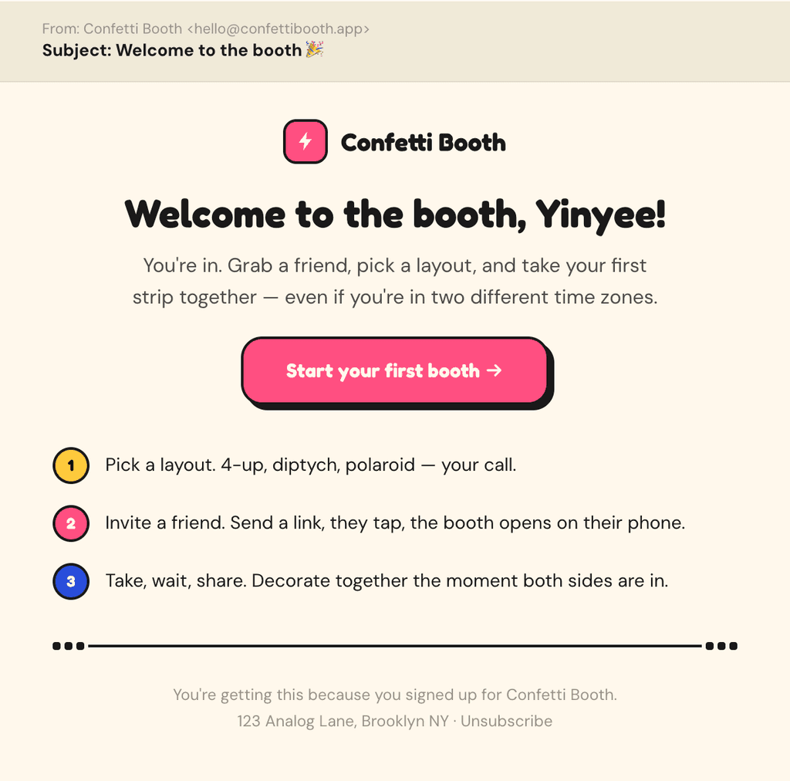 |

| Instagram story: share | Instagram post: promotion |
| :---: | :---: |
| 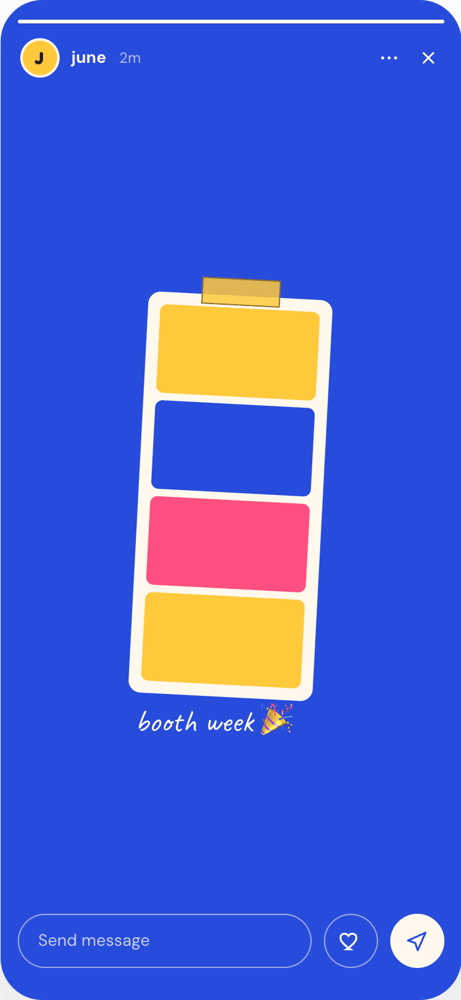 | 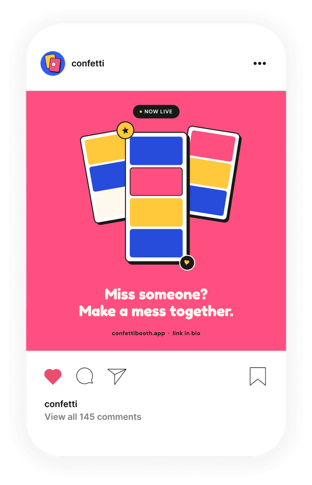 |

---

## Copy as the interface

### Naming: "Nudge Mia" instead of "Send reminder"

A reminder is transactional; a nudge is playful. It implies a relationship with enough history, comfort and safety to tease. One word can shift the emotional register of the entire waiting room.

### Digitally native: lowercase branding

Lowercase resembles how people actually communicate online. It reads as casual, human and approachable, and visually reduces the sense of distance. Internet culture has normalised lowercase texting, loose punctuation and emoji, so the brand borrows that internet-native visual and written language.

---

## Design system

Tokens and components for the Confetti Booth direction: colors, type, spacing, the signature sticker/offset-shadow treatment, and the core component set. Designed in Paper and mirrored in code:

| Token | Hex | Used for |
| --- | --- | --- |
| Ink | `#191919` | text, borders, offset shadows |
| Paper | `#FFF7EC` | app background |
| Hibiscus | `#FF4F81` | primary CTAs, live states, hearts |
| Cobalt | `#2F5DFF` | capture context, links, status widget |
| Citrus | `#FFC93C` | highlights, ready/star states, stickers |

Type is **Fredoka** (display, headlines, buttons), **DM Sans** (body, meta, labels) and **Caveat** (handwritten captions). One accent leads per moment; the other two appear only in stickers and details.

Everything lives in [`lib/tokens.ts`](lib/tokens.ts), with shared components in [`components/ui`](components/ui).

---

## The app

The prototype follows the full flow from the Paper file:

**Splash → How it works → Home → New booth → Invite → Notification → Pick booth → Capture → Waiting → Decorate → Keepsake → Share** (→ Story / Print)

Things you can try:

- **New booth:** pick a layout (4×1, 2×1, 2×2, 3×1), solo or invite, and a tag
- **Invite:** copy the one-time link and choose who to invite; the next screen is their lock screen getting the push
- **Capture:** uses your real camera. Confetti asks first, then the browser prompts for permission. 3-2-1 countdown with flash for each shot, plus timer, flash and flip (front/back) toggles. Your photos fill the strip through to Share, Story, Print and Home. If the camera is blocked or missing, you can carry on with placeholder shots.
- **Waiting:** *Nudge Mia* and watch her half come in live; add a caption that follows the strip through to the story
- **Decorate:** add stickers and drag them around (double-click one to remove it), plus text styles, filters (B&W, warm, faded, bold) and borders
- **Share:** send, post to story, save to your strips (it shows up on Home) or print with pickup/mail

## Running it

Built with Next.js 14, React 18 and Framer Motion.

```bash
npm install
npm run dev
```

Then open [http://localhost:3000](http://localhost:3000). It's designed as a mobile app, so it looks best in a phone-sized window.

### Deploying

The repo is ready to deploy as-is, with no environment variables needed.

**Vercel:** [vercel.com/new](https://vercel.com/new) → import `confetti` → Deploy. Settings come from `vercel.json`.

**Netlify:** [app.netlify.com/start](https://app.netlify.com/start) → import from GitHub → pick `confetti` → Deploy. Settings come from `netlify.toml`.

Both use Node 20 (`.nvmrc`) and `npm run build`. Every push to `main` redeploys automatically once connected.

### Project structure

```
app/                  Next.js entry (layout, page, global styles)
components/
  AppShell.tsx        Flow state, screen transitions, toasts
  screens/            One file per screen: Splash, HowItWorks, Home, NewBooth,
                      Invite, Notification, PickBooth, Capture, Waiting,
                      Decorate, Keepsake, Share, Story, Print
  ui/                 Shared pieces: kit (buttons, chips, headers), Strip, Icon
lib/
  tokens.ts           Design tokens (colors, type, spacing)
  types.ts            Shared types
public/               PWA manifest, app icons, hand-drawn tab icons
docs/media/           Case study images and videos used in this README
netlify.toml          Netlify build settings
vercel.json           Vercel build settings
```

---

<p align="center">2026 ˙⋆✮⋆˚࿔ Yinyee Ho ˙⋆✮⋆˚࿔</p>
